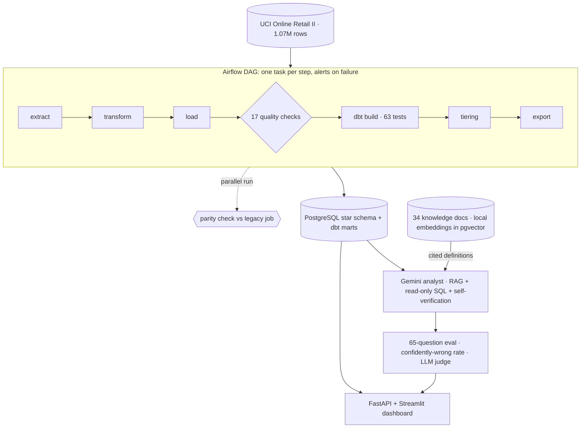

# Retail Sales Data Platform

An orchestrated, tested ELT pipeline into PostgreSQL + dbt, a customer tiering model validated on future revenue, and a Gemini text-to-SQL analyst measured on how often it is **confidently wrong**, served through FastAPI and a Streamlit dashboard.

**Live demo:** https://retail-sales-platform.streamlit.app · **Numbers:** [RESULTS.md](RESULTS.md) (generated by code) · **Why each choice:** [docs/DECISIONS.md](docs/DECISIONS.md)



| Area | Key result |
|---|---|
| **Pipeline quality** | 1,067,371 raw rows → 776,579 sales lines. 17 checks per load, **0 failing** (16 pass, 1 warning). Revenue reconciled to the penny (£17,068,582.72); reruns are byte-identical |
| **dbt layer** | 11 models, **63 tests passing**; after the migration, tier scores match v1 **bit for bit** for all 4,908 customers |
| **Migration parity** | Clean run **100%** (46/46 checks). An injected silent bug (Norway dropped) passed all 17 quality checks and 63 dbt tests, and was **caught by parity at 58.7%** |
| **Tiering** | Tier 1 (top 10%) earned **58.3%** of next-6-month revenue, monotonic £5,073 → £125 by tier. **Monetary-only did better: 62.3%**; learned v2 weights 62.6%; XGBoost/LightGBM 61.2%, no better than the simple score |
| **AI analyst** | Confidently-wrong rate **3.4% → 1.6% → 0.2%** (17/495 → 8/495 → 1/440) with a glossary, then a self-check; v3 execution accuracy 97.7–100% on 3 Gemini models |
| **RAG knowledge layer** | 10 new questions that need a business definition: **20% → 100%** correct with retrieval (confidently wrong 60% → 0%). All 65 questions: confidently wrong **9.2% → 1.5%**, execution accuracy 84.9% → 98.1%. One regression: RAG broke 1 of the frozen 55. Retrieval recall@8 **0.94**, MRR 0.79 (answerable questions) |
| **Self-verification + judge** | Number check caught **51/51** injected errors and repaired all 51, but found **0** in the real answers, so confidently wrong stayed 1.5%. LLM judge: 94.3% faithful, 67.9% citations correct; **judge–human agreement pending human labels** |

<details><summary>Stack</summary>

Python, pandas, PostgreSQL 16, pgvector, sentence-transformers, dbt, Airflow 3, scikit-learn, XGBoost, LightGBM, FastAPI, Streamlit, Docker, pytest, ruff, GitHub Actions, Gemini API. Data: Online Retail II, UCI Machine Learning Repository, CC BY 4.0.
</details>

---

# Details

Star schema: `fact_sales` and `fact_cancellations` (order-line grain) share the `dim_customer`, `dim_product` and `dim_date` dimensions ([`sql/schema.sql`](sql/schema.sql)). A dbt project (`dbt/`) builds the analytics layer that the tiering model reads. Revenue is concentrated: the top 10% of customers drive **63.9%** of it, and the top 1% drive **32.1%**.

## Charts


## How the pipeline guarantees correctness

`python -m pipeline.run` runs extract → transform → load → checks, and exits non-zero if any check fails.

- **Idempotent load.** One transaction truncates all five warehouse tables and bulk-loads them with `COPY`. Re-running gives the same tables, and a crash half-way rolls back to the last good load, so readers never see a half-empty warehouse. Surrogate keys come from the deterministic transform order. Each run writes an md5 fingerprint of every table's full content to `etl_run_log`, and two runs on the same input match exactly.
- **Independent reconciliation.** Postgres recomputes `revenue = quantity * price` itself as a generated `NUMERIC` column, so the revenue check compares two separate calculations rather than a copied column. A truncated price type, a dropped batch or a double `COPY` would all fail it.
- **Checks** (`pipeline/quality.py`):
  - row counts per table
  - revenue reconciled to the penny
  - no nulls in keys
  - positive quantity and price
  - unique keys
  - referential integrity
  - schema drift against a stored contract (`pipeline/contract.json`), for both the raw extract and the warehouse
  - monthly volume anomaly (more than 3 sd from the rolling 6-month median)
  - freshness: the newest loaded invoice equals the newest source invoice
- **Volume check: two parts.**
  - A **partial-period** test flags any month whose data covers under 50% of its calendar days. It catches December 2011 (9 of 31 days) and would catch a load that silently stopped mid-month. The Christmas shutdown (sales stop around 23 December) is not flagged.
  - A **row-count z-score** compares each full month with the rolling median of the previous 6 full months.
  - The first version had only the z-score and *missed* the partial month, because the Sep–Nov peaks inflate the rolling standard deviation. It still flags those seasonal peaks, since it has no year-over-year baseline, which is why the check is a WARN, not a FAIL.
- **Tests:** 54 pytest tests cover:
  - each cleaning rule, on hand-made tables
  - load idempotency, and quality checks failing on a silent row loss, against a real Postgres
  - the tiering score, tiers, the cutoff in the SQL features, and `explain`
  - SQL guardrails and result matching

  GitHub Actions runs them on every push against a `postgres:16` service.

## dbt transformation layer (`dbt/`)

`python -m pipeline.dbt_runner build` runs `dbt build` against the same database as the pipeline: it builds every model, then runs every test.

**Layers.**
- **Source:** the loader's quality-checked tables in `retail`.
- **`staging/`:** 4 views that rename and type the raw columns (`invoice → invoice_id`, `stock_code → product_code`, `price → unit_price`).
- **`marts/`:** 7 tables in `analytics`:
  - `fct_sales` and `fct_cancellations`;
  - `dim_customer` (home country plus lifetime stats), `dim_product` and `dim_date`;
  - **`mart_customer_features`**: the 8 tiering features, one row per (cutoff date, customer), for both the training cutoff (2010-12-01) and the scoring cutoff (2011-06-01);
  - **`mart_customer_tiers`**: the tiering score and tier, re-implemented in SQL.

**Tests: 63 in total, all passing.** They break down into 34 `not_null`, 12 `unique`, 8 `relationships`, 5 `accepted_values`, and 4 custom:
- **revenue reconciliation**: the mart equals the source, overall and in every month;
- **no future-dated invoices**;
- **tier shares** of 10/20/30/40%;
- **unique (cutoff date, customer)** in the feature mart.

`figures/06_dbt_lineage.png` is a screenshot of the lineage graph from `dbt docs`.

**Tiering now reads from `mart_customer_features`** instead of the raw tables, and the outputs match v1 *exactly*. Before changing any code I froze v1's per-customer scores and tiers (`metrics/v1_tiers.csv`, 4,908 customers). `python -m tiering.verify_dbt` then asserts three things, with no tolerance:
- the mart features equal v1's SQL (73,176 values, both cutoffs);
- the Python tiers computed from the mart equal v1 for every customer, **scores bit for bit**;
- the SQL tier mart equals v1 too.

The SQL twin matches to the bit because its percentile rank reproduces pandas' tie-averaging, and it sums in the same order as pandas. Everything in `metrics/tiering.json` and the charts is unchanged. CI runs a real `dbt build` on a synthetic dataset and asserts the same equalities (`tests/test_dbt.py`).


## Orchestration and migration parity (`orchestration/`, `migration/`)

**Headline: a bug that passed every internal check was caught by the parallel-run parity check before cutover.**

I injected a transform regression into the Airflow run: it silently drops every Norway sales line (1,263 rows, 0.23% of revenue). The DAG still finished **`success`**, with all 7 tasks green, **0 of 17 quality checks failing, and 63 of 63 dbt tests passing**. The parity check against the legacy job failed it immediately:
- **parity 58.7%**, with 19 of 46 checks differing: 2 row counts, 15 column checksums, sales revenue (£17,068,582.72 vs £17,030,007.36);
- the country drill-down named **Norway: 1,263 → 0 rows**;
- 5 customers vanished from the tiers and 1 more changed tier;
- a structured alert was written to `logs/alerts.jsonl` and the check exited 1 ("do not decommission the legacy job").

The clean run scored **parity 100%**: 46 of 46 checks, with all 4,908 customers in the same tier.

Why the internal checks can't see this: every one of them compares the warehouse with *the run's own* transform output. If the transform itself is wrong, loaded rows still equal transformed rows, and revenue still reconciles to the penny. Detecting it needs an **independent reference**, which is what a parallel run of the legacy job gives you. It's the same reason a migration needs a parity period before the old system is switched off.

**The DAG** (`orchestration/dags/retail_pipeline.py`, Airflow 3.1.8):
- **Task chain:** `extract → transform → load → quality → dbt_build → tiering → export`.
- **Tasks:** each is `python -m pipeline.steps <task>`, reusing the v1 functions unchanged and handing data over through files in `data/runs/<run>/`.
- **Retries: none.** A data-quality failure won't fix itself on retry.
- **`max_active_runs=1`**, because two runs would truncate each other's tables.
- **Failure handling:** a failure in any task writes a structured alert (timestamp, source, check, message, Airflow `run_id`, details) and exits non-zero, so Airflow marks everything downstream `upstream_failed`.

Demonstrated with a *loud* bug (10 negative prices): `quality` **failed** with "1 quality check(s) failed: positive_quantity_price_sales", and `dbt_build`, `tiering` and `export` never ran.

**Why Airflow and not Prefect.** Airflow runs here, so the Prefect fallback wasn't needed. It runs standalone: `airflow dags test` with a SQLite metadata DB, no scheduler or webserver. It lives in **its own virtualenv** (`.venv-airflow`, installed with Airflow's official constraints file), because its pinned SQLAlchemy and other dependencies would otherwise replace the project's.

**What is compared** (`migration/parity_check.py`): the legacy job (`python -m pipeline.run --schema legacy_retail` plus v1 tiering) and the DAG (into `orch_retail` / `orch_analytics`) are run into separate schemas. The check then compares:
- row counts for all 5 warehouse tables;
- an md5 checksum of **every column** in key order (38 in total), so changed values are caught, not just changed counts;
- revenue totals, as exact `NUMERIC` values;
- the tier of every customer.

It also drills down by country, so a mismatch comes with a likely cause. Reports: `migration/reports/parity_clean.md`, `parity_injected.md` and `alerts_demo.jsonl`.

## Tiering method and validation

Scored on **2011-06-01** using only earlier transactions, then judged on what each customer spent **2011-06-01 to 2011-11-30**. That time split is the leakage guard: no feature can see the outcome.

1. **8 features** are computed in SQL (`tiering/features.py`):
   - recency
   - frequency
   - monetary
   - tenure
   - average order value
   - product breadth
   - cancellation rate
   - regularity (std dev of days between orders)
2. Each feature becomes a **0–1 percentile rank**. Recency, cancellation rate and irregularity are inverted, so 1 is always best. Because every input is a percentile, a weight means the same thing whatever the units.
3. **Score** = weighted sum with documented v1 weights: recency 0.25, frequency 0.25, monetary 0.30, breadth 0.10, cancellation 0.10. Tenure, AOV and regularity carry 0 in v1.
4. **Tiers** by score rank: Tier 1 = top 10%, Tier 2 = next 20%, Tier 3 = next 30%, Tier 4 = bottom 40%.

| Method (4,908 customers) | Spearman vs future revenue | Top 10% captures |
|---|---|---|
| **Hand-weighted v1** | **0.607** (best) | 58.3% |
| Monetary only | 0.569 | 62.3% |
| Equal weights | 0.580 | 52.8% |
| Logistic regression (trained on Dec 2010 → May 2011) | 0.596 | 62.6% |
| Gradient boosting (same training) | 0.573 | 61.3% |
| XGBoost (same training, untuned) | 0.558 | 61.2% |
| LightGBM (same training, untuned) | 0.557 | 61.2% |
| v2: learned weights rounded to 0.05 | 0.600 | 62.6% |

Gradient-boosted trees did not beat the simple score on this data, so the explainable weighted score stays. XGBoost and LightGBM both put about half their split gain on monetary value (49% and 48%).

**What this says.** v1 ranks the *whole* customer base best (highest Spearman), because recency and frequency separate "will buy again" from "gone". But the top of the list is about who spends big, and a pure monetary ranking wins there.

The learned model is trained one period earlier, so its test is out of sample. It moves weight *toward* monetary (0.42) and average order value (0.19), and *away from* breadth and cancellations (about 0).

**What I would ship.** v2 is still a five-number weighted sum anyone can audit, it matches the learned model's top-10% capture, and it keeps most of v1's ranking quality. Its gain over monetary-only is small, though (+0.3 points), and that is worth saying out loud.

**Weight sensitivity.** Changing any single weight by ±50% moves at most **8.3%** of customers to a different tier. Top-10% capture stays within 57.5–59.4%, so the tiers are not an artefact of one arbitrary number.

**Explainability: `explain(customer_id)`**. Two worked examples (`python -c "from tiering.score import explain; print(explain(12346)['text'])"`):

```
Customer 15716: Tier 1, score 85.2/100 (rank 245 of 4,908)
  Revenue to date (£)                    2,266.37  percentile  78.7  x weight 0.30  =  23.6 pts
  Days since last order                        10  percentile  93.4  x weight 0.25  =  23.4 pts
  Orders                                       10  percentile  88.3  x weight 0.25  =  22.1 pts
  Distinct products bought                    174  percentile  90.6  x weight 0.10  =   9.1 pts
  Share of orders cancelled                     0  percentile  70.9  x weight 0.10  =   7.1 pts
```
*For a sales manager:* "This customer ordered 10 days ago, orders often, buys a wide range and never cancels, so they are Tier 1 even though their total spend is only above-average." (In fact they spent just £216 in the next six months. A tier is a probability, not a promise.)

```
Customer 12346: Tier 3, score 60.1/100 (rank 1,679 of 4,908)
  Revenue to date (£)                   77,352.96  percentile  99.8  x weight 0.30  =  29.9 pts
  Orders                                        3  percentile  54.4  x weight 0.25  =  13.6 pts
  Days since last order                       134  percentile  51.9  x weight 0.25  =  13.0 pts
  Distinct products bought                     25  percentile  35.4  x weight 0.10  =   3.5 pts
  Share of orders cancelled                  0.62  percentile   0.9  x weight 0.10  =   0.1 pts
```
*For a sales manager:* "Their £77k is almost all one order that was then cancelled. They have bought only 3 times and not for 4 months, so they sit in Tier 3 despite the biggest single order in the data." They spent £0 in the next six months. This is the case where monetary-only ranking is fooled and the multi-factor score is not.

## AI analyst (`analyst/`)

`python -m analyst.agent "question"` asks Gemini for **one read-only SQL query**, runs it in Postgres and answers in plain English. The FastAPI service (`service/api.py`, see *Serving it*) exposes it as `POST /ask`.

**Guardrails**, in layers:
1. The model may **abstain**: "I can't answer that from this data."
2. `validate_sql()` accepts a single `SELECT`/`WITH` only. It rejects DDL/DML, `SELECT INTO`, multiple statements, `pg_sleep`, `set_config`, and similar.
3. The query runs as **`analyst_ro`**, a Postgres role with only `SELECT` on the warehouse, `default_transaction_read_only` and a **15 s statement timeout**. A test proves the role cannot write even if the first two layers were bypassed.
4. At most 200 rows are fetched.

On a SQL error the model gets **one retry**, with the error message fed back. API 429/5xx responses get exponential backoff with jitter, honouring the server's `retryDelay`. Every call is logged to `logs/analyst.jsonl` (question, SQL, latency, success), and answers are cached per model.

**Evaluation** (`analyst/evaluate.py`, `analyst/eval_set.yaml`):
- **Ground truth:** 55 questions (6 easy, 10 medium, 27 hard, 12 unanswerable), each answerable one with a hand-written reference SQL.
- **Grading compares result sets, not SQL text.** Rows are matched order-insensitively with numeric tolerance, and extra columns are allowed. Two different queries that return the same numbers are both right, and a plausible-looking query that returns the wrong numbers is wrong.
- **Confidently wrong** (the headline): the analyst answered (did not abstain, the SQL ran) and the answer was wrong, *or* it answered an unanswerable question. These are the dangerous cases: an authoritative-looking number that is false.

**How the eval set got to v2, and why that matters.** The first set (31 answerable + 8 unanswerable, each question spelling out its definitions) **saturated**: models scored 100%. A hand audit of the few "wrong" verdicts showed they were grader bugs, not model errors: a month returned as `2011-01` instead of a date, a share given as 0.796 instead of 79.6. I fixed the matcher, with unit tests, to accept equivalent month formats and, only for questions flagged `unit: percent`, fractions.

I then made the set harder **before** running the self-check mitigation, adding 15 items:
- net vs gross revenue
- questions that tempt a sales × cancellations join
- multi-step time comparisons
- ambiguous business terms ("active customer")
- 4 more unanswerable questions

That set is frozen as **eval set v2** (its SHA-256 is pinned in `tests/test_analyst.py`). v1, v2 and v3 were then re-run on exactly that file for every model, so the comparison is apples to apples.

**Mitigations.** Each targets a failure mode seen in the baseline, not a specific question:
- **v2, business glossary.** The company's metric definitions: revenue = gross sales, "net" only when asked; order = invoice; returns = cancellations. Plus a no-proxy rule: if a concept has no column, abstain.
- **v3, glossary + self-check.** After the SQL runs, the model sees the SQL and a result preview. It checks for fan-out joins, filtering before window functions, wrong units or periods, implausible values and proxy metrics, then confirms, fixes or abstains.

| Model (3 runs each) | v1 baseline | v2 + glossary | v3 + self-check |
|---|---|---|---|
| gemini-3.5-flash: confidently wrong | 2.4% (4/165) | 0.0% (0/165) | 0.0% (0/110)* |
| gemini-3.5-flash-lite: confidently wrong | 4.2% (7/165) | 3.0% (5/165) | 0.6% (1/165) |
| gemini-3.1-flash-lite: confidently wrong | 3.6% (6/165) | 1.8% (3/165) | 0.0% (0/165) |
| Execution accuracy (range over models) | 94.6–97.7% | 94.6–100% | 97.7–100% |
| Abstention accuracy (range) | 91.7–100% | 100% | 100% |
| Latency p50 / p95 (range over models, s) | 0.9–5.0 / 2.1–23.5 | 1.0–3.7 / 2.4–9.6 | 1.4–7.2 / 2.3–15.7 |

\*2 complete runs: the API key's prepaid credits ran out (HTTP 402) during the third. Full per-run numbers and every failing question are in [RESULTS.md](RESULTS.md).

**What went wrong, and what fixed it.** I hand-checked every "wrong" verdict against the reference.
- **Definition drift** (fixed by v2). gemini-3.5-flash computed "total revenue in 2010" net of cancellations in 3 of 3 runs: £7.74M instead of the official £8.22M.
- **Fabricated proxy** (fixed by v2). gemini-3.1-flash-lite answered "profit margin" with an invented formula (result 1.0) instead of abstaining.
- **Fan-out joins** (mostly fixed by v3). Joining sales to cancellations on customer or date multiplied rows: £31.4M "net revenue" for one customer (true top: £570K), *negative* £356M for 2011, and 6,851 "new customers" in a month (true: 221).
- **Filtering before `LAG`** (1 run left in v3). The first month of the window lost its previous month.

**Honest caveats.**
- The glossary *alone* made gemini-3.5-flash-lite slightly worse on some items. Its "add cancellations over the same period" wording seems to have nudged it into a date-join fan-out.
- The self-check rewrote SQL in only **2** of 165 runs for gemini-3.5-flash-lite (both correct fixes), so part of that model's v2 → v3 drop is run-to-run variance even at temperature 0. For gemini-3.1-flash-lite it fixed **12** runs, all correctly, and accounts for the whole drop.
- The self-check doubles the LLM calls per question.
- The statement timeout also turned two runaway `CROSS JOIN`s into visible errors instead of wrong numbers.

## Knowledge layer (RAG), LLM judge and self-verification (`knowledge/`, `rag/`, `analyst/`)

The v1–v3 analyst only sees the schema and a short glossary. Real questions depend on **business definitions** that live in documents, not columns. So the analyst now reads a small knowledge base before it writes SQL.

**Knowledge base** (`knowledge/`, 34 markdown docs with front matter: type, owner, `last_updated`, `deprecated`, `superseded_by`):
- metric definitions: revenue, net revenue, AOV, active customer, churn, cancellation rate, repeat rate, new customer, international revenue, large order, peak season;
- tier methodology and validation, data caveats (partial Dec 2011, missing customer IDs, GBP, what the data doesn't contain), table docs, and a precedence policy;
- **4 deliberate traps**: 3 docs marked deprecated (a 365-day churn, a 180-day active customer, a gross-revenue AOV) and an older sales FAQ that contradicts current definitions *without* being flagged.

**Retrieval** (`rag/`):
- Docs are split into paragraph-aware chunks, each prefixed with its title.
- Chunks are embedded **locally** with `all-MiniLM-L6-v2` (384-d, free, no API) and stored in **pgvector** (`knowledge.chunks`) with their metadata. Search is exact cosine: at a few hundred rows, an approximate index would only cost recall.
- Deprecated chunks get a 0.10 similarity penalty and are labelled "DEPRECATED, superseded by …" in the prompt.
- **v4** puts the top-8 chunks in front of the question and must return `citations`: the doc ids it used.

**Retrieval eval** (`python -m rag.evaluate`; hand-labelled relevant docs for all 65 questions in `knowledge/relevance.yaml`):

| chunks | k | recall, answerable (53) | MRR, answerable | recall, unanswerable (12) |
|---|---|---|---|---|
| 32 words | 3 / 5 / 8 | 0.75 / 0.83 / 0.90 | 0.69 / 0.71 / 0.72 | 0 |
| 128 words | 3 / 5 / 8 | 0.78 / 0.91 / 0.94 | 0.78 / 0.79 / 0.80 | 0 |
| **whole doc** | 3 / 5 / **8** | 0.78 / 0.92 / **0.94** | 0.77 / 0.78 / **0.79** | 0.04 at k = 8 |

The setting was chosen by a rule fixed before looking at the results: best recall@8, then the smallest k within 0.02 of it. Chunk size barely matters because the docs are short (mean 88 words).

Two findings:
- **Retrieval fails on unanswerable questions.** A doc that lists what the data does *not* contain ("no cost, no salesperson…") matches almost nothing, because questions ask about the missing thing, not about its absence. The agent still refused all 12, from the schema.
- **The deprecation penalty works.** It keeps a deprecated doc from outranking the current definition for every definition question. Without it, one outranks the current definition for 10–20% of them. Trap docs still reach the prompt: at the chosen setting, 60% of definition questions have one in the context. Even with deprecated docs excluded it is 30%, because of the unflagged FAQ, so the agent has to resolve that conflict itself.

**10 new definition-dependent questions** (`analyst/eval_set_defs.yaml`) are a separate frozen set; the 55 are unchanged. Examples: "How many active customers did we have at the end of Q3 2011?", "What was our AOV in 2011?". Each reference follows the current doc. The deprecated reading gives a different number every time: 2,919 vs 2,145 active customers, and £480.48 vs £445.60 AOV.

**Ablation** (`python -m analyst.ablation`, gemini-3.1-flash-lite, 2 runs per condition). No-RAG on the 55 reuses the cached v3 runs 0–1, which used the same question file (SHA-checked), prompt and model:

| | exec. accuracy | confidently wrong | p50 / p95 (s) | cost / question |
|---|---|---|---|---|
| No RAG (v3), 10 definition questions | 20% | **60%** (12/20) | 1.8 / 3.4 | CA$0.0009 |
| RAG (v4), 10 definition questions | **100%** | **0%** | 2.0 / 3.2 | CA$0.0021 |
| No RAG (v3), frozen 55 | 100% | 0% | 1.8 / 3.6 | |
| RAG (v4), frozen 55 | 97.7% | 1.8% (2/110) | 1.9 / 2.6 | |
| **All 65: no RAG → RAG** | **84.9% → 98.1%** | **9.2% → 1.5%** (12/130 → 2/130) | 1.8 → 1.9 / 3.6 → 2.6 | |

- Without the knowledge base the model guessed definitions and delivered them with confidence: the deprecated gross AOV (£480.48 vs £445.60), international revenue including "Unspecified", its own churn window (4,026 vs 3,050), and a different peak season (33.3% vs 36.2%). On "large order" and churn rate it abstained: safe, but no answer.
- **RAG broke one question**, m04: "average order value, where an order's value is the total revenue of its invoice". The net-revenue AOV doc overrode the definition stated in the question, in both runs, even though the precedence policy says the question wins.
- Every answer cited at least one doc; all 20 definition answers cited the defining doc; none cited a deprecated doc.
- **Caveat:** I wrote both the docs and the definition questions, so 20% → 100% is an upper bound on what RAG adds.

**LLM judge** (`python -m analyst.judge`, the same model, temperature 0). It sees the question, SQL, result, answer and the shown docs, never the grade. On the 106 answered v4 responses: **94.3% faithful** to the result and **67.9% citations correct**.
- All 6 "unfaithful" verdicts are *non-numeric* claims, e.g. "cancellations are excluded" in a gross-revenue answer.
- Most citation failures are over-citing: a relevant but unnecessary doc.

**Judge–human agreement: pending human labels.** 30 blind answers are in `labels/human_labels.csv` for hand labelling; `python -m analyst.agreement` then reports accuracy and Cohen's kappa. Until then the judge is **uncalibrated**, and the demo labels its verdicts as a hint only.

**Self-verification (v5)**: after the answer is written, every number in it must match a cell of the SQL result (rounding, %, £ and "million" allowed), a constant in the SQL, the row count or the question. If one doesn't, the answer is rewritten once from the result; if it still fails, the agent abstains. It is deterministic, and a call is made only on a mismatch.
- **On the real answers it changed nothing:** 106/106 passed, 0 rewrites, and confidently wrong stayed at 1.5%.
- The two remaining errors (m04) faithfully restate a *wrong* result, which a number check cannot see.
- On **fault injection** (the headline number of 51 answers corrupted, 2,145 → 3,145), it caught **51/51** and rewrote all 51 back to the right number.
- So it is a cheap guard against narration errors that this model did not make here; it does not fix wrong SQL. A first version flagged "90 days" and "£1,000" in 8 correct answers (definition constants), which is why constants written in the SQL count as supported.

**All versions, gemini-3.1-flash-lite** (`python -m analyst.final_table`):

| version | questions | exec. accuracy | abstention acc. | confidently wrong | p50 / p95 (s) | cost / question |
|---|---|---|---|---|---|---|
| v1 baseline | frozen 55 × 3 | 97.7% | 91.7% | 3.6% | 2.7 / 7.0 | not measured |
| v2 + glossary | frozen 55 × 3 | 97.7% | 100% | 1.8% | 1.0 / 2.4 | not measured |
| v3 + SQL self-check | frozen 55 × 3 | 100% | 100% | 0.0% | 1.8 / 3.5 | CA$0.0009 |
| v3 + SQL self-check | all 65 × 2 | 84.9% | 100% | 9.2% | 1.8 / 3.6 | CA$0.0009 |
| v4 + RAG | all 65 × 2 | 98.1% | 100% | 1.5% | 1.9 / 2.6 | CA$0.0021 |
| v5 + self-verification | all 65 × 2 | 98.1% | 100% | 1.5% | 1.9 / 2.6 | CA$0.0021 |

Cost counts the SQL, self-check and verification calls at list price; the prose answer adds about CA$0.0003. **Budget:** Phases 7–8 made 491 Gemini calls for an estimated **CA$0.39** of the CA$8 cap. `analyst/budget.py` records every call's tokens in `metrics/gemini_ledger.json` and refuses any call that could pass the cap.

## Serving it: API, dashboard, Docker (`service/`, `dashboard/`)

Everything here runs from **`demo/demo.sqlite`**, a 1.93 MB pre-aggregated database committed to the repo, so it needs neither Postgres nor the raw dataset nor an API key. `python -m service.build_demo` rebuilds it from the full pipeline. It contains:
- the KPIs and overview tables;
- all 4,908 scored customers, so the same `explain()` runs offline;
- 635 cached answers from the eval runs, each with its SQL, result rows, correctness label and the reference result: v1–v3 × 3 models on the frozen 55, plus v3, v4 (RAG) and v5 (RAG + self-verification) of gemini-3.1-flash-lite on the 10 definition questions and v4/v5 on the 55. The v4/v5 rows carry the model's own prose answer, its citations, the self-verification status and the (uncalibrated) judge verdict;
- the 34 knowledge-base docs, so cited definitions can be shown.

**FastAPI** (`uvicorn service.api:app`, async):

| Endpoint | What it returns |
|---|---|
| `GET /health` | status, what it serves from, cache statistics, whether live mode is on |
| `GET /customers/{id}/tier` | tier, score, rank and the full `explain()` breakdown; a clear 404 for unscored customers |
| `POST /ask` | the cached eval answer: SQL, rows, answer and its **correctness label** (correct / confidently wrong / refused / error). Defaults to gemini-3.1-flash-lite **v5**, and returns `citations`, `self_verification` and the judge verdict marked "pending human labels" |

- An uncached question gets a **404 saying no answer is given rather than a guess**, plus the three closest cached questions.
- **Live mode** calls Gemini only with `ANALYST_LIVE=1` and a key. It has a 10-per-hour rate limit, and a timeout or error returns an explicit 504/503 fallback, never a made-up answer.
- **Logging and caching:** every request is logged as one JSON line (request id, path, status, latency, cache hit), and responses are held in an in-process TTL cache.

**Docker.** `docker build -t retail-api . && docker run -p 8000:8000 retail-api`, or `docker compose up --build` for the API plus Postgres 16. Both were tested in this environment: the image builds, the container's healthcheck reports `healthy`, all three endpoints answer, the API container reaches the Postgres container, and hadolint is clean. Live mode through compose is **untested**: it needs the warehouse loaded into the compose Postgres and API credits.

**Streamlit dashboard** (`streamlit run dashboard/app.py`):
- **Overview:** KPI tiles and four charts (revenue by month, future revenue by tier, the capture curve, quality checks).
- **Tier Explorer:** pick any customer to see their tier and how many points each input adds.
- **Ask the Data:** pick one of the 65 eval questions, a model and a prompt version (default: v5, RAG + self-verification), and see the answer, the **cited definitions** (click to read the doc), the self-verification and abstain flags, the SQL, the result, the correctness label and, when it's wrong, the reference answer. The judge's verdict is shown as an uncalibrated hint. A grid shows how every model × prompt combination did on that question.

Live mode appears only when **both** `GEMINI_API_KEY` and `DATABASE_URL` secrets exist, with a hard limit of 5 questions per session and 30 per hour across all users. It runs prompt v3 (no RAG), because the Cloud app has no local embedding model or knowledge index, and it is **untested** on Cloud.

### Deploy

The live demo runs on Streamlit Community Cloud from the `main` branch. A scheduled GitHub Actions job (keep-alive.yml) visits the demo every 6 hours so it doesn't sleep. To deploy it elsewhere:

- **Entrypoint:** `dashboard/app.py`
- **Requirements:** `dashboard/requirements.txt`, a light dashboard-only list. Streamlit picks it up because it sits next to the entrypoint; the root `requirements.txt` (dbt, pgserver) is not needed.
- **Python:** 3.11
- **Secrets:** none. Demo mode serves everything from `demo/demo.sqlite`. Live mode is optional and untested on Cloud; it needs both `GEMINI_API_KEY` and `DATABASE_URL`, pointing at a hosted Postgres loaded with `python -m pipeline.run` and `python -m pipeline.dbt_runner build`.

The same app, with only the committed files and only `dashboard/requirements.txt` installed, was tested headless in a fresh virtualenv: it rendered with no errors, and without importing psycopg, SQLAlchemy, google-genai or dbt.

## Earlier analysis (kept from v1 of this project)

- **Cleaning** (`pipeline/transform.py`, `notebooks/01_clean.ipynb`). The steps run in a fixed order and each one is logged:
  - drop rows with no Customer ID
  - set cancellations aside (17.6% of invoices, 6.2% of revenue)
  - drop non-positive quantity or price
  - drop exact duplicates
  - drop non-product codes (postage, fees, adjustments, tests; the exact codes found are listed in RESULTS.md)

  In total **27.2%** of rows are removed, 22.8 points of it from missing Customer IDs.
- **SQL** (`sql/analysis/*.sql`, run from `notebooks/02_sql_analysis.ipynb`). These queries were first written for DuckDB and then ported to Postgres; every headline number came out identical, a free parity check between the engines. They cover:
  - monthly trends
  - top countries
  - top 3 products per country (`ROW_NUMBER() OVER (PARTITION BY country ...)`)
  - revenue concentration and a Lorenz curve
  - month-over-month retention (pooled **38.6%**)
- **RFM** (`notebooks/03_rfm.ipynb`). Quintile R/F/M scores and seven rule-based segments: Champions are **25.2%** of customers but **69.2%** of revenue, and **828 At-Risk** customers hold £1.59M of historical revenue.

## Limitations

- One retailer, one market: **83.7%** of revenue is from the UK. There is no cost or margin data, so everything is revenue, not profit.
- 22.8% of rows have no Customer ID and are excluded, so customer-level results describe identified (mostly B2B) buyers only.
- Tiering is validated on one cutoff and one 6-month window. **14.1%** of that window's revenue came from new customers who could not be scored at all. A rolling multi-cutoff backtest would give confidence intervals.
- The analyst eval is small: 55 questions × 3 runs, so a single answer moves the rate by about 0.6 points. The mitigations were designed after seeing baseline failures on the same set, so the v2/v3 gains may be optimistic on unseen questions; a held-out question set is the next step. Models were limited to the Gemini Flash family, first by free-tier quota and then by prepaid credits.
- **RAG and self-verification** were measured on one model (gemini-3.1-flash-lite, the only one in budget), 2 runs, and 65 questions. The knowledge docs and the 10 definition questions were written by the same person, so the definition-question gain is an upper bound. Retrieval misses the "out of scope" doc for unanswerable questions. Self-verification checks numbers only: it cannot catch a faithful restatement of a wrong query, or a wrong non-numeric claim.
- **The LLM judge is not calibrated yet**: judge–human agreement is pending 30 hand labels, and until then its verdicts are hints, not measurements. The judge is the same model it grades.
- Orchestration runs locally via `airflow dags test` (SQLite metadata, no scheduler). A deployed setup would need a Postgres metadata DB, a real executor and alert delivery (Slack or PagerDuty) reading `logs/alerts.jsonl`. The parity check compares full snapshots; at larger scale it would compare per-partition checksums instead.

## How to run

```bash
pip install -r requirements.txt
# Online Retail II, UCI Machine Learning Repository, CC BY 4.0
curl -L -o data/online_retail_ii.zip "https://archive.ics.uci.edu/static/public/502/online+retail+ii.zip"
unzip data/online_retail_ii.zip -d data/

python -m pipeline.run          # extract -> clean -> load PostgreSQL (embedded pgserver) -> 17 checks
pytest                          # 105 tests; uses the same embedded Postgres (or DATABASE_URL)
ruff check .                    # lint + type hints on public functions (also in CI)
python -m pipeline.dbt_runner build   # dbt: 11 models + 63 tests into schema analytics
python -m tiering.verify_dbt    # assert dbt features/tiers == frozen v1 output
python -m tiering.validate      # tiers, baselines, learned weights, sensitivity, charts

# Phase 6: Airflow in its own venv (see requirements-airflow.txt), then:
python -m orchestration.run_dag --run-name orchestrated                   # the DAG, end to end
python -m migration.parity_check                                          # legacy vs DAG: expect 100%
python -m migration.parity_check --inject-bug drop_country:Norway         # silent failure: caught, exit 1

# Phase 9: serving
python -m service.build_demo          # rebuild demo/demo.sqlite from the full pipeline
uvicorn service.api:app --port 8000   # API
streamlit run dashboard/app.py        # dashboard
docker compose up --build             # API + Postgres

export GEMINI_API_KEY=...       # never committed; .env is gitignored
python -m analyst.agent "Which 5 countries had the most revenue in 2011?"
python -m analyst.evaluate --prompt v1 --runs 3
python -m analyst.evaluate --prompt v2 --runs 3
python -m analyst.evaluate --compare v1 v2

# Phases 7-8: RAG, judge, self-verification (gemini-3.1-flash-lite; every call is priced and capped)
pip install -r requirements-rag.txt               # sentence-transformers for local embeddings
python -m analyst.budget --plan                   # estimated calls and cost before running anything
python -m rag.evaluate                            # build the pgvector index, retrieval eval (no API calls)
python -m analyst.evaluate --prompt v4 --runs 2 --model gemini-3.1-flash-lite --set defs --narrate
python -m analyst.evaluate --prompt v4 --runs 2 --model gemini-3.1-flash-lite --set frozen --narrate
python -m analyst.ablation                        # with vs without RAG
python -m analyst.judge                           # LLM judge on the v4 answers
python -m analyst.self_verify                     # v5: replay + fault injection
python -m analyst.final_table                     # every version in one table
python -m analyst.agreement                       # after labels/human_labels.csv is filled in

jupyter nbconvert --to notebook --execute --inplace notebooks/0*.ipynb
python src/make_results.py      # metrics/*.json -> RESULTS.md
```

PostgreSQL comes from [`pgserver`](https://pypi.org/project/pgserver/) (embedded Postgres 16, no Docker); set `DATABASE_URL` to use any other server.

**Data:** Online Retail II, UCI Machine Learning Repository, CC BY 4.0.
